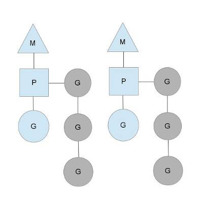

Go的协程
---

---

# Go协程和线程的区别

* 资源调度
	* 线程由内核调度，根据cpu时间片执行抢占式调度
	* 协程由程序调度(runtime包)，执行协同式调度(2中会详述)

* 内存占用
	* 执行线程所需的栈内存至少是MB级别
	* 执行协程只需要4KB左右的栈内存

* 上下文切换
	* 线程涉及到用户态和内核态的切换：需要通用寄存器(8个)，程序计数器PC，指令寄存器IR，地址寄存器AR，累加寄存器AC，状态寄存器EFLAGS等
	* 协程上下文切换只涉及到栈指针和三个寄存器(程序计数器PC, 栈指针寄存器SP, 数据寄存器DX）的切换

ps: 单核多线程未必会提高效率，更多的抢占式调度和上下文切换，有时反而会让效率降低；经验之谈：3 thread per core is best(from Bill)

> 参考链接
> 
> * [Golang协程详解](http://www.cnblogs.com/liang1101/p/7285955.html)
> * [通用寄存器](https://blog.csdn.net/sinat_38972110/article/details/72927858)

# Go协程调度

> 参考链接
> 
> * [golang之协程](http://www.cnblogs.com/chenny7/p/4498322.html)
> * [goroutine的生老病死](https://tiancaiamao.gitbooks.io/go-internals/content/zh/05.2.html)